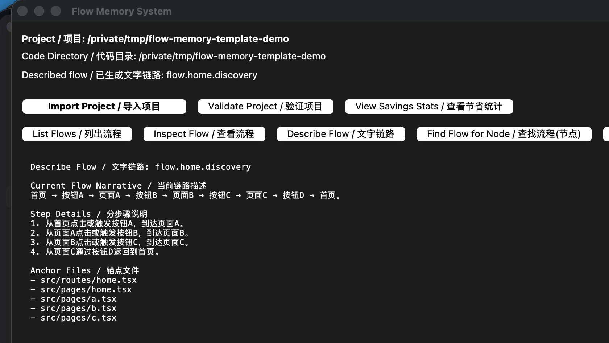

# Screenshots

This page shows real screenshots from the desktop app using a sanitized demo project.

本页展示的是桌面应用的真实截图，使用的是一个去除了个人路径和私有项目内容的演示项目。

## Main Window

What this screenshot demonstrates:

- a project is loaded successfully
- the GUI can render a plain-language flow narrative
- users can inspect jump logic without reading source code first

这张图主要展示：

- 项目已经被成功加载
- GUI 可以展示“文字版流程链路”
- 用户无需先读源码，也能先理解跳转逻辑
