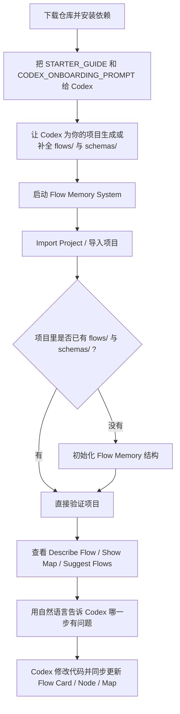

# Flow Memory User Guide / 用户接入指南

This guide explains how to add Flow Memory System to your own repository, how to use the GUI, and how Codex can consume the flow data before changing code.

本指南说明如何把 Flow Memory System 接入你自己的代码仓库、如何使用图形界面，以及 Codex 在修改代码前应如何使用这些流程数据。

## 1. Quick Start: Import vs Open / 快速上手：导入 和 打开 的区别

The GUI now provides a prominent `Import Project / 导入项目` button. Use it as the default entry point.

现在图形界面提供了显眼的 `Import Project / 导入项目` 按钮。对初学者来说，默认就用它。

- `Import Project / 导入项目`
  If the selected directory already contains `flows/` and `schemas/`, the app opens it directly. If they are missing, the app asks whether it should initialize Flow Memory automatically, then validates the project.
- `Open... / 打开项目`
  Use this when you already know the project has a complete Flow Memory structure and you just want to load it.
- `Initialize Flow Memory / 初始化 Flow Memory`
  This only creates the `flows/` and `schemas/` structure. It does not automatically open a different project unless you choose that directory.

- `Import Project / 导入项目`
  如果所选目录已经有 `flows/` 和 `schemas/`，程序会直接打开并验证；如果没有，程序会先询问是否自动初始化，然后再验证。
- `Open... / 打开项目`
  当你已经确认项目里有完整的 Flow Memory 结构时，用它直接加载即可。
- `Initialize Flow Memory / 初始化 Flow Memory`
  这个动作只负责创建 `flows/` 和 `schemas/` 结构；它本身不等于“理解并打开一个现成项目”。

### GUI Walkthrough / 界面示意

```text
Project / 项目: /path/to/your-project
Code Directory / 代码目录: /path/to/your-project
Ready / 就绪

[Import Project / 导入项目] [Validate Project / 验证项目] [View Savings Stats / 查看节省统计]
[List Flows / 列出流程] [Inspect Flow / 查看流程] [Describe Flow / 文字链路]
[Find Flow for Node / 查找流程(节点)]
[Show Map / 显示地图] [Suggest Flows / 推荐流程]
```

If you do not know which button to click first, click `Import Project / 导入项目`.

如果你不知道第一步该点哪个按钮，就点 `Import Project / 导入项目`。

## 1.5 Recommended Workflow / 推荐使用流程

For most users, the best workflow is:

对大多数用户来说，最推荐的使用方式是：

1. Download this repository and install dependencies
2. Give `docs/STARTER_GUIDE.md` and `CODEX_ONBOARDING_PROMPT.md` to Codex or your AI agent
3. Let the AI help create or complete `flows/` and `schemas/` for your own project
4. Open Flow Memory System
5. Import your project
6. Use `Describe Flow`, `Show Map`, and `Suggest Flows` to understand the logic chain
7. If you find a problem, describe the broken step in natural language and let the AI fix it

1. 下载这个仓库并安装依赖
2. 把 `docs/STARTER_GUIDE.md` 和 `CODEX_ONBOARDING_PROMPT.md` 给 Codex 或其他 AI agent 阅读
3. 让 AI 先帮你的项目建立或补全 `flows/` 和 `schemas/`
4. 打开 Flow Memory System
5. 导入你的项目
6. 使用 `Describe Flow`、`Show Map`、`Suggest Flows` 理解项目链路
7. 如果发现问题，就直接用自然语言描述“哪一步坏了”，再让 AI 去修改

### Workflow Diagram / 使用流程图



The key point is: users do not need to start from source code. They can start from the flow view.

关键点是：用户不需要从源码开始理解项目，而是可以先从“业务链路视图”开始。

## 2. What You Need / 需要准备什么

Your project should contain these directories and files at the root:

你的项目根目录需要包含以下结构：

```text
your-project/
  flows/
    cards/
    nodes/
    map.yaml
    conventions.md
  schemas/
    FlowCard.schema.json
    Node.schema.json
    Map.schema.json
```

If this is your first time using Flow Memory, you can initialize the structure with:

如果你是第一次使用 Flow Memory，可以直接初始化模板：

```bash
./.venv/bin/python init_flow_memory.py /path/to/your-project
```

Or use the GUI:

或者使用图形界面：

- `Import Project / 导入项目`
- or `Project / 项目 -> Initialize Flow Memory / 初始化 Flow Memory`

## 3. Import or Open a Project in the GUI / 在图形界面中导入或打开项目

Launch the app with the project virtual environment:

建议使用项目虚拟环境启动程序：

```bash
./.venv/bin/python fm_app.py
```

Or use the shell launcher:

或者使用启动脚本：

- `./run_fm_app.command`

If you want a macOS app bundle, rebuild it locally with:

如果你想要 macOS 的 `.app` 启动器，可以在本地重新生成：

```bash
./build_mac_app.command
```

### Recommended Path / 推荐路径

1. Click `Import Project / 导入项目`
2. Select your project root
3. If `flows/` or `schemas/` are missing, confirm the initialization prompt
4. The app will automatically validate the project after import

1. 点击 `Import Project / 导入项目`
2. 选择你的项目根目录
3. 如果缺少 `flows/` 或 `schemas/`，确认弹出的初始化提示
4. 程序会在导入后自动执行验证

When validation succeeds, the status line shows the number of flows and nodes.

验证成功后，状态栏会显示流程数和节点数。

### When to Use Open... / 什么时候用 Open...

Use `Project / 项目 -> Open... / 打开项目` only when the selected directory already has a complete Flow Memory layout.

只有当你确认所选目录已经具备完整的 Flow Memory 结构时，才建议使用 `Project / 项目 -> Open... / 打开项目`。

### Example / 示例

```text
Import Project / 导入项目

Project / 项目: /path/to/your-project
Code Directory / 代码目录: /path/to/your-project

Existing Flow Memory structure detected / 已检测到现有 Flow Memory 结构。

Validation successful / 验证成功: 2 条流程, 14 个节点
```

## 4. Typical GUI Actions / 常见 GUI 操作

### List Flows / 列出流程

Shows every Flow ID, name, and status.

显示所有 Flow ID、名称和状态。

Example output:

```text
- flow.record_list_refresh: Record List Refresh (active)
- flow.text_record_lifecycle: Text Record Lifecycle (active)
```

### Inspect Flow / 查看流程

Select a flow from the popup list. The output panel will show:

从弹出的列表中选择一个流程后，输出区会显示：

- A simple text diagram of the flow path
- A plain-language narrative of the flow path
- Anchor files to read first
- The full Flow Card JSON

### Describe Flow / 文字链路

Select a flow from the popup list. The app will generate a plain-language chain such as:

从弹出的列表中选择一个流程后，程序会生成类似下面这种文字链路：

```text
首页 → 按钮A → 页面A → 按钮B → 页面B → 按钮C → 页面C → 按钮D → 首页。
```

This view is intended for non-technical users. It makes it easier to explain:

这个视图是给非技术用户看的，便于直接描述：

- where the user starts / 用户从哪里开始
- which button or trigger is involved / 哪个按钮或触发点参与了跳转
- which page or state comes next / 下一步到了哪个页面或状态
- where the return path goes / 返回路径回到哪里

### Find Flow for Node / 查找流程(节点)

Select a Node ID such as `persistence.text_records` or `route.records_list`.

选择一个节点 ID，例如 `persistence.text_records` 或 `route.records_list`。

The app will list every flow that references that node.

程序会列出所有引用该节点的流程。

### Show Map / 显示地图

Displays:

显示：

- `transfer_nodes / 换乘节点`
- `impact_rules / 影响规则`

Use this view to understand which flows may be affected when a shared persistence, route, or service changes.

这个视图适合判断：当某个共享持久化、路由或服务变更时，会影响哪些流程。

### View Savings Stats / 查看节省统计

This button reads the helper logs and prints a small usage report.

这个按钮会读取辅助日志并输出一份简短统计。

The report includes:

统计内容包括：

- call count / 调用次数
- success rate / 成功率
- average matched flow count / 平均命中流程数
- average anchor/context file count / 平均锚点文件数与上下文文件数
- average elapsed time / 平均耗时
- token fields if you provide them programmatically / 如果你在代码里提供 token 数据，也会显示 token 统计

### Suggest Flows / 推荐流程

Describe a bug or requirement in plain language, for example:

用自然语言描述 bug 或需求，例如：

```text
刷新按钮没有作用
新建记录保存后列表不更新
delete not reflected in UI after refresh
```

The app will suggest the most relevant flows and list their anchor files.

程序会推荐最相关的流程，并列出它们的锚点文件。

## 5. How to Add or Update Flow Data / 如何新增或更新流程数据

When your project adds a new business journey:

当项目里出现新的业务链路时：

1. Create a new Flow Card in `flows/cards/`
2. Add any new pages, routes, UI elements, state stores, services, or persistence keys to `flows/nodes/`
3. Update `flows/map.yaml` if the new flow introduces shared nodes or new impact rules
4. Run validation again

修改代码后也要同步更新：

1. `watch_points`
2. `common_failures`
3. `related_flows`
4. `transfer_nodes`
5. `impact_rules`

This keeps the YAML model aligned with the real codebase.

这样可以保证 YAML 模型和实际代码保持一致。

## 6. Codex Integration / Codex 整合方式

Codex should use Flow Memory before opening many files.

Codex 在大规模读文件之前，应该先调用 Flow Memory。

Recommended sequence:

推荐顺序：

1. Use `suggest_flows_for_bug()` to map the issue to one or more flows
2. Use `get_anchor_files()` to retrieve the core files to read first
3. Use `load_flow()` to inspect steps, persistence, watch points, and related flows
4. After code changes, update the affected Flow Card, Node, and Metro Map

### Example / 示例

```python
from ai_helper import suggest_flows_for_bug, get_anchor_files, load_flow

description = "刷新按钮没有作用"
flows = suggest_flows_for_bug(description)

if flows:
    primary_flow = flows[0].flow_id
    files = get_anchor_files(primary_flow)
    flow_data = load_flow(primary_flow)

    print(primary_flow)
    print(files)
    print(flow_data["watch_points"])
```

If you can measure extra runtime context, you can also pass optional metrics into the helper functions:

如果你能拿到额外的运行时上下文，也可以把可选指标传给辅助函数：

```python
from ai_helper import suggest_flows_for_bug

suggestions = suggest_flows_for_bug(
    "刷新按钮没有作用",
    metrics={
        "input_tokens": 180,
        "output_tokens": 96,
        "total_tokens": 276,
    },
)
```

There is also a ready-made example wrapper:

项目里还提供了一个现成的示例包装脚本：

- `codex_flow_wrapper.py`

CLI example:

```bash
./.venv/bin/python codex_flow_wrapper.py "新建记录保存后列表不更新"
```

## 7. Logging and Benefit Measurement / 日志与效果评估

The helper functions now log usage automatically to:

辅助函数现在会自动把调用日志写到：

```text
flow_memory_logs/YYYY-MM-DD.jsonl
```

Logged functions:

被记录的函数：

- `load_flow()`
- `get_anchor_files()`
- `suggest_flows_for_bug()`

Each log record includes:

每条日志会记录：

- input text or Flow ID / 输入内容或 Flow ID
- matched flow count / 命中流程数
- returned anchor file count / 返回锚点文件数
- context file count / 上下文文件数
- elapsed time / 调用耗时
- success or failure / 是否成功
- optional token counts if provided / 如果调用方提供，还会记录 token 数

Analyze logs with:

用下面的脚本查看统计：

```bash
./.venv/bin/python analyze_logs.py
```

Or use the GUI button:

或者直接使用 GUI 按钮：

`View Savings Stats / 查看节省统计`

Example output:

```text
suggest_flows_for_bug
  calls / 调用次数: 8
  success rate / 成功率: 8/8 (100.0%)
  avg matched flows / 平均命中流程数: 1.75
  avg anchor files / 平均返回锚点文件数: 3.50
  avg context files / 平均上下文文件数: 3.50
  avg elapsed ms / 平均耗时(ms): 6.42
```

These metrics help compare:

这些指标可以帮助比较：

- How many flows are usually returned
- How many files Codex needs to read first
- How much time the lookup adds
- Whether Flow Memory is reducing the initial file set that Codex needs to load
- Token usage, when your integration can provide those numbers
